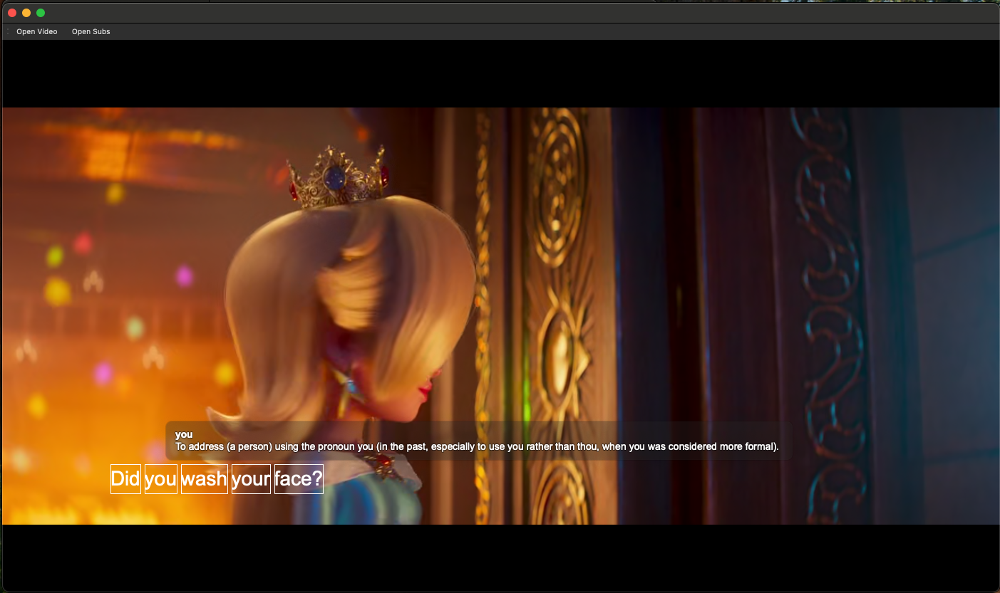
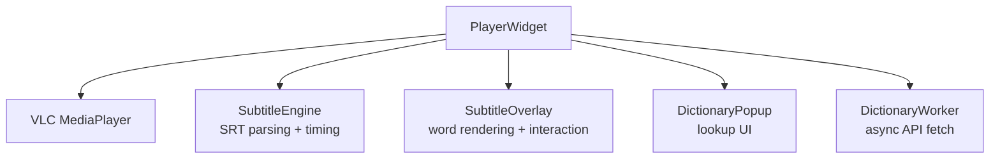
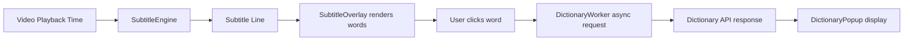

## 📘 VLCL

A PyQt6 + VLC-based language learning video player with interactive subtitles and word-level dictionary lookup.

## 🧠 Overview

VLCL is a custom video player designed for language acquisition. Unlike standard media players, it renders subtitles in a fully interactive overlay, enabling word-by-word interaction, dictionary lookup, and future spaced repetition integration.

### Core idea:

turn passive video watching into active vocabulary learning.

### ✨ Current Features

#### 🎥 Video Playback

VLC-backed media playback (python-vlc)
Supports local video files (MKV, MP4, etc.)
Basic play/pause/seek integration via VLC API

#### 📝 Subtitle System (Custom Engine)

External .srt loading via pysubs2
Manual subtitle timing engine (not VLC subtitles)
Subtitle selection based on playback timestamp
Supports line navigation and replay

#### 🧩 Interactive Subtitle Overlay

Fully custom QWidget overlay rendered above video
Word-level segmentation of subtitles
Clickable words (mouse hit-testing per word bounding box)
Transparent rendering layer over video
Toggle visibility (S key)

#### 📖 Dictionary Integration (WIP but functional)

Online dictionary API integration (dictionaryapi.dev)
Async lookup via Qt threads
Popup window display on word click
Basic caching (planned/partial depending on version)

#### ⌨️ Keyboard Controls (basic)

S → toggle subtitle overlay
R → replay current subtitle segment

#### ⚙️ Tech Stack

Python 3.9+
PyQt6 (UI + event loop)
VLC (media playback engine)
pysubs2 (subtitle parsing)
Dictionary API (REST)

#### 🧱 Architecture

### Flow:

### 🚧 Known Issues

#### Stability
* Occasional VLC decoder timestamp warnings (harmless)
* Dictionary API can return None → must be handled safely (partially done, needs loading and correct error messages)
#### UI / Rendering
* Overlay positioning still being tuned
* Word bounding logic is approximate (not glyph-accurate yet)
* No responsive layout scaling for different video sizes
#### Interaction
* No keyboard navigation between words/subtitles
* No pause-on-click behavior yet

### 🛣️ Roadmap

#### 🔴 Phase 1 — Stability & correctness (next step)

 Fix dictionary normalization layer (strict schema)
 Remove all raw API dependency from UI layer
 Add safe fallback rendering for missing data
 Improve word tokenization (punctuation handling)
 Fix overlay sizing relative to video frame

#### 🟠 Phase 2 — Player UX improvements

 Pause video on word click
 Auto-resume after popup close
 Add hover highlight on words
 Add subtitle click → seek to timestamp
 Add keyboard word navigation (left/right word selection)

#### 🟡 Phase 3 — Dictionary upgrade

 Add phonetics + audio pronunciation playback
 Multiple meanings display (part-of-speech grouping)
 Example sentences
 Language selection (EN → FR/DE/etc.)
 Offline fallback dictionary cache

#### 🟢 Phase 4 — Learning system (core goal)

 Save clicked words to local database (SQLite)
 Spaced repetition system (Anki-like scheduling)
 “Known / Learning / Unknown” tagging
 Word frequency tracking per video
 Subtitle export with highlighted vocabulary

#### 🔵 Phase 5 — Advanced subtitle intelligence

 Better word alignment (glyph-level layout, not heuristic widths)
 Multi-line subtitle shaping engine
 Subtitle timing smoothing (reduce jitter)
 Optional dual subtitles (native + target language)

#### 🟣 Phase 6 — Media intelligence (advanced)

 Auto subtitle detection from MKV tracks (VLC integration optional)
 Whisper-based subtitle generation (AI transcription)
 Sentence segmentation vs raw subtitle lines
 Context-aware dictionary suggestions

## 🎯 Design Philosophy

This project is intentionally:

local-first
low-latency
interaction-heavy
built around comprehension, not passive viewing

The goal is not a media player with subtitles.

It is:

a reading + listening + vocabulary acquisition environment built on top of video.